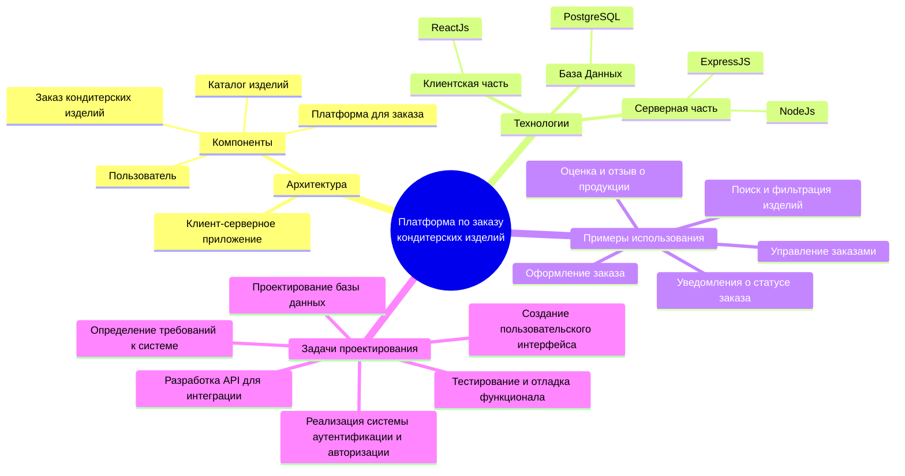
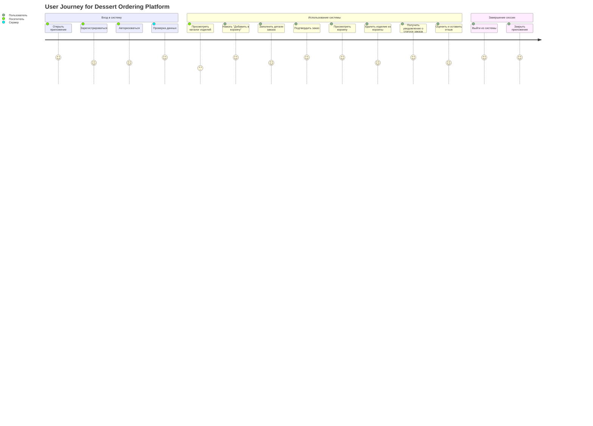
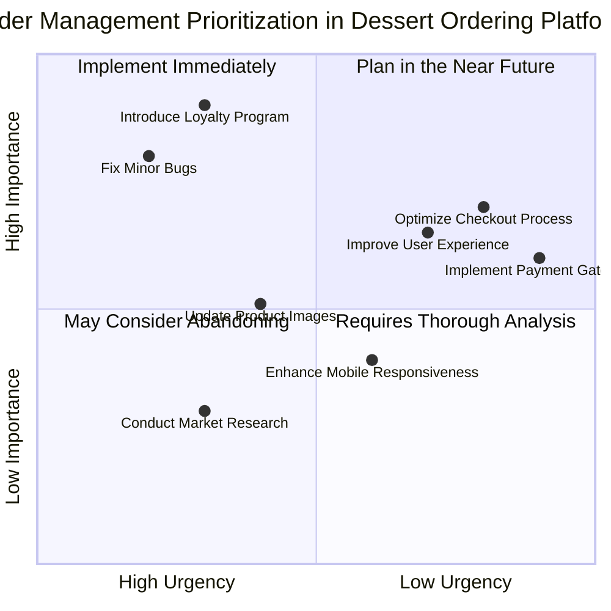
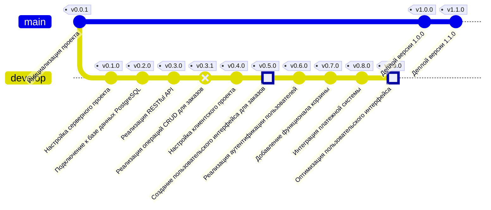

```mermaid
mindmap
  root((Платформа по заказу
  кондитерских изделий))
    Архитектура
      Клиент-серверное приложение
      ::icon(fa fa-server)
      Компоненты
        Пользователь
        Платформа для заказа
        Заказ кондитерских изделий
        Каталог изделий
    Технологии
      Серверная часть
        NodeJs
        ExpressJS
      База Данных
        PostgreSQL
      Клиентская часть
        ReactJs
    Примеры использования
      Поиск и фильтрация изделий
      Оформление заказа
      Управление заказами
      Уведомления о статусе заказа
      Оценка и отзыв о продукции
    Задачи проектирования
      Определение требований к системе
      Проектирование базы данных
      Разработка API для интеграции
      Создание пользовательского интерфейса
      Реализация системы аутентификации и авторизации
      Тестирование и отладка функционала


```

```mermaid
journey
    title User Journey for Dessert Ordering Platform
    section Вход в систему
      Открыть приложение: 5: Посетитель
      Зарегистрироваться: 4: Посетитель
      Авторизоваться: 4: Посетитель
      Проверка данных: 5: Сервер
  
    section Использование системы
      Просмотреть каталог изделий: 3: Посетитель
      Нажать "Добавить в корзину": 5: Пользователь
      Заполнить детали заказа: 4: Пользователь
      Подтвердить заказ: 5: Пользователь
      Просмотреть корзину: 5: Пользователь
      Удалить изделие из корзины: 4: Пользователь
      Получить уведомление о статусе заказа: 5: Пользователь
      Оценить и оставить отзыв: 4: Пользователь
  
    section Завершение сессии
      Выйти из системы: 5: Пользователь
      Закрыть приложение: 5: Пользователь

```

```mermaid
quadrantChart
    title Order Management Prioritization in Dessert Ordering Platform
    x-axis High Urgency --> Low Urgency
    y-axis Low Importance --> High Importance
    quadrant-1 Plan in the Near Future
    quadrant-2 Implement Immediately
    quadrant-3 May Consider Abandoning
    quadrant-4 Requires Thorough Analysis
    Optimize Checkout Process: [0.8, 0.7]
    Introduce Loyalty Program: [0.3, 0.9]
    Update Product Images: [0.4, 0.51]
    Fix Minor Bugs: [0.2, 0.8]
    Enhance Mobile Responsiveness: [0.6, 0.4]
    Conduct Market Research: [0.3, 0.3]
    Improve User Experience: [0.7, 0.65]
    Implement Payment Gateway: [0.9, 0.6]
```

```mermaid
gitGraph
  commit id: "Инициализация проекта" tag: "v0.0.1"
  branch develop
  commit id: "Настройка серверного проекта" tag: "v0.1.0"
  commit id: "Подключение к базе данных PostgreSQL" tag: "v0.2.0"
  commit id: "Реализация RESTful API" tag: "v0.3.0"
  commit id: "Реализация операций CRUD для заказов" type: REVERSE tag: "v0.3.1"
  commit id: "Настройка клиентского проекта" tag: "v0.4.0"
  commit id: "Создание пользовательского интерфейса для заказов" type: HIGHLIGHT tag: "v0.5.0"
  commit id: "Реализация аутентификации пользователей" tag: "v0.6.0"
  commit id: "Добавление функционала корзины" tag: "v0.7.0"
  commit id: "Интеграция платежной системы" tag: "v0.8.0"
  commit id: "Оптимизация пользовательского интерфейса" type: HIGHLIGHT tag: "v0.9.0"
  checkout main
  commit id: "Деплой версии 1.0.0" tag: "v1.0.0"
  commit id: "Деплой версии 1.1.0" tag: "v1.1.0"

```
